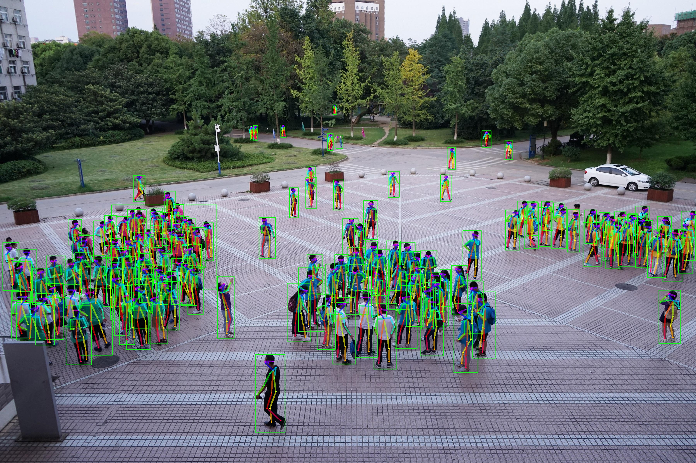
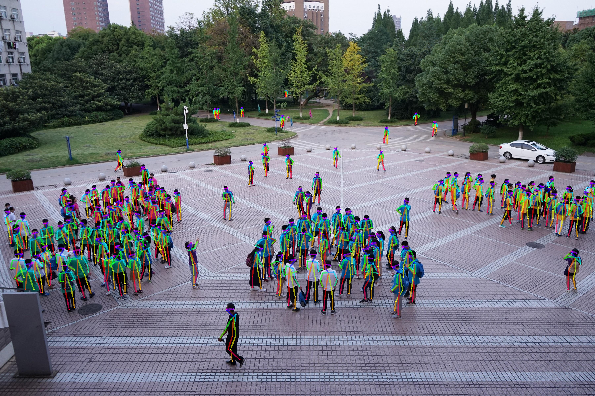
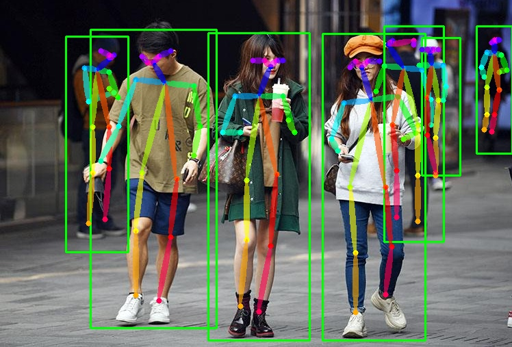
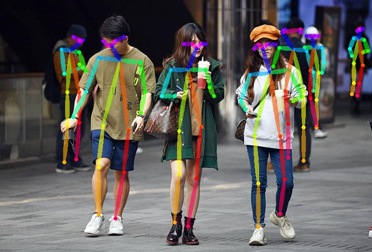

# Amazing_Pose_Estimate_V2
CPU Real-time Amazing Pose Estimate V2
# FIND CODE  
https://blog.csdn.net/samylee/article/details/112056728  
# Test steps
## step1
Download 'third_part dll' and put it to current directory. [BaiDu Cloud](https://pan.baidu.com/s/1XbvPhLLrjZz3Ll-QbKbUkw) Password: oxvo 
## step2
Set parameters: 
`AmazingPoseEstimateV2.exe with_rectangle with_whole_image test_type img_path` 
`with_rectangle`: choose with rectangle or without rectangle when show results (0 for without, 1 for with)
`with_whole_image`: choose whole image or resized image when detect image (0 for without, 1 for with. tips: whole image detection will get higher accuracy, but slower speed ) 
```cpp
like:  AmazingPoseEstimateV2.exe 1 0 imgdir /img/path/test_imgs  (for imgdir)
or:    AmazingPoseEstimateV2.exe 1 0 video AVG-TownCentre.mp4  (for video)
or:    AmazingPoseEstimateV2.exe 1 0 video 0  (for usbcam)
```
# Algorithm efficiency
| Algorithm | net_size | mAP | Speed/FPS | hardware | 
|:------:|:------:|:------:|:------:|:------:|
| OpenPose         | 368x-1 | 0.6152 | 70ms/14.3 | GPU(nvidia-gtx1080)|
| Pose Estimate V1 | 368x-1 | 0.3912 | 60ms/16.6 | CPU(i7-9700K) |
| Pose Estimate V2 | 608x-1 | 0.6267 | *16ms/62.5* | CPU(i7-9700K) |
`*Pose Estimate V2: Add one person, and the time will increase by 10ms on average*`
# Example result




# Reference
https://blog.csdn.net/samylee
